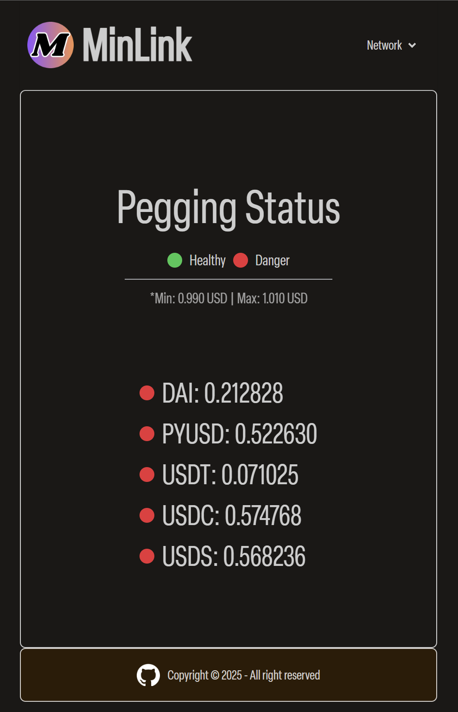
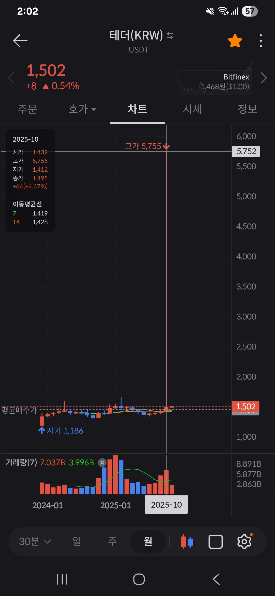

# Minlink

Lightweight stable coin pegging monitoring tool.

Targeting Ethereum Mainnet specifically.

## Why

Stable means that it intends to not change easily.

Then is stable coin really stable?

October 11, 2025, `USDT` price on bithumb exchange had soared to `5,755 KRW`, which is absolutely above on the promised pegged value `1 USD`.

Liquidity on centralized/decentralized exchange can fluctuate depending on external market factor.

Cefis will make up for the demages when legulation is placed and user files issues but in the case of defis - well, things will be getting more complicated for sure.

Thus, I thought like maybe it is a safe move to set a proper monitoring tool for each trader, you know, just in case.

This tool intends to be a home/research/inidividual use. Use a certified tool like [`Chainlink price feeds`](https://data.chain.link/) if you need some professional approach and more diversed data sources to this problem.

## Tech stack

| Section | Details                      |
| ------- | ---------------------------- |
| Client  | `htmx`, `tailwind`, `daiyui` |
| Server  | `gin`, `swagger`             |
| Infra   | `Docker`, `docker swarm`     |

---

## Reference

- [optimism status page](https://status.optimism.io/)
- [(단독)빗썸 '테더 338% 폭등' 사태…레버리지 상품 결함 드러나](https://www.newstomato.com/ReadNews.aspx?no=1277633)
